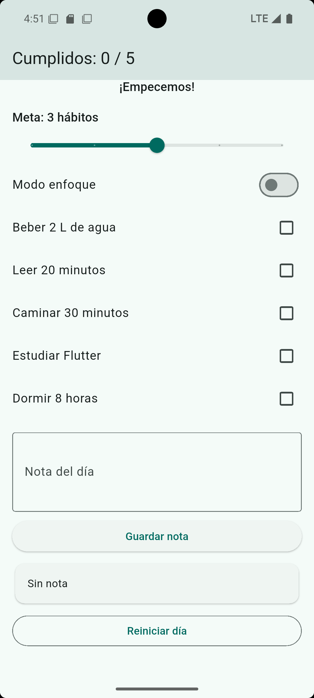
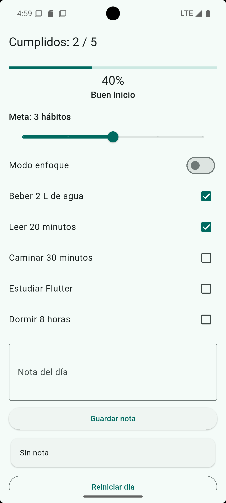
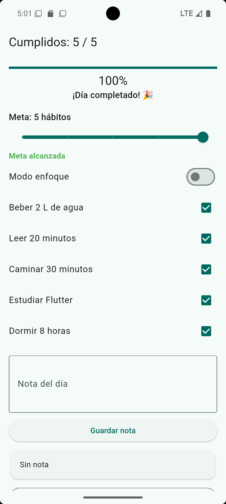
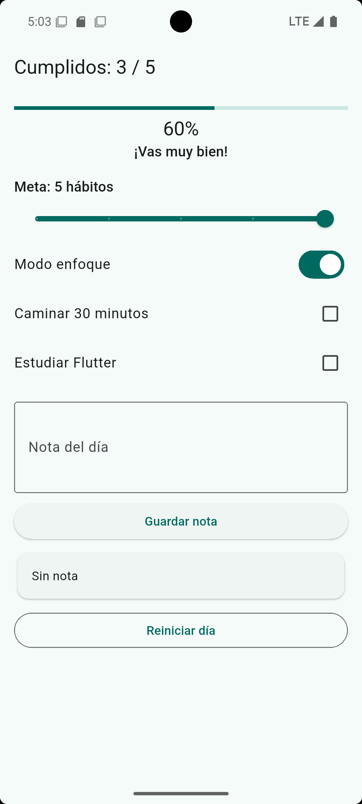

# Panel de hábitos del día

## Identificación del laboratorio

E2_L1 Laboratorio 1 — Interfaz interactiva con actualización dinámica

**Estudiante:** Oscar Villatoro  
**Tecnología:** Flutter / Dart  
**Semana:** 7

## Descripción

Aplicación interactiva que permite registrar el cumplimiento de cinco hábitos diarios, visualizar el progreso, establecer una meta, utilizar un modo enfoque y guardar una nota del día.

## Funcionalidades implementadas

- Registro de cinco hábitos mediante casillas de verificación.
- Conteo de hábitos cumplidos y barra de progreso.
- Porcentaje de avance y mensaje motivacional dinámico.
- Selección de una meta diaria entre uno y cinco hábitos.
- Indicador de meta alcanzada.
- Modo enfoque para ocultar los hábitos ya cumplidos.
- Registro y visualización de una nota del día.
- Reinicio completo del estado del día.

## Variables de estado

- `_cumplidos`: lista de valores booleanos que indica cuáles hábitos han sido completados.
- `_meta`: cantidad de hábitos que se deben completar para alcanzar la meta diaria.
- `_enfoque`: indica si el modo enfoque está activado para ocultar los hábitos cumplidos.
- `_nota`: almacena la nota del día guardada por el usuario.
- `_notaCtrl`: controlador del campo de texto utilizado para ingresar la nota del día.

## Información derivada

`_totalCumplidos`, `_progreso`, `_metaAlcanzada` y `_mensaje` se calculan mediante getters a partir de las variables de estado. Estos valores no se guardan como estado duplicado, lo que evita inconsistencias y mantiene una única fuente de información.

## Evidencias

### Estado inicial

<p>
  
</p>

### Progreso parcial

<p>
  
</p>

### Día completado

<p>
  
</p>

### Modo enfoque

<p>
  
</p>

## Reflexión

Un error posible sería modificar las variables de estado sin utilizar `setState()`, lo que impediría que Flutter reconstruya la interfaz para mostrar los cambios. Además, el `TextEditingController` se libera en el método `dispose()` para administrar correctamente los recursos utilizados por el widget.

## Validación

Se ejecutaron los siguientes comandos:

```bash
dart format .
flutter analyze
```

El resultado de `flutter analyze` fue `No issues found!`.

## Repositorio

https://github.com/OAvillatoro/lab_habitos_Oscar_Villatoro

## Video de demostración

[Ver video de demostración en YouTube](https://youtu.be/8WcXIC4Kjr4)
